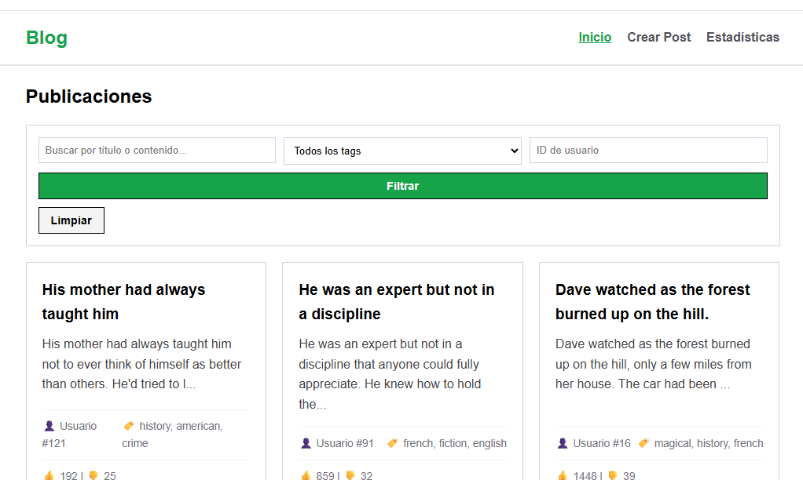
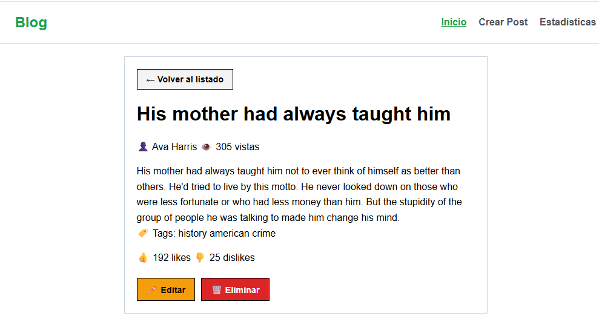
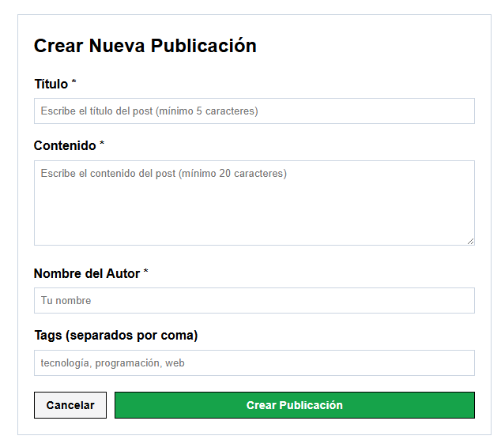
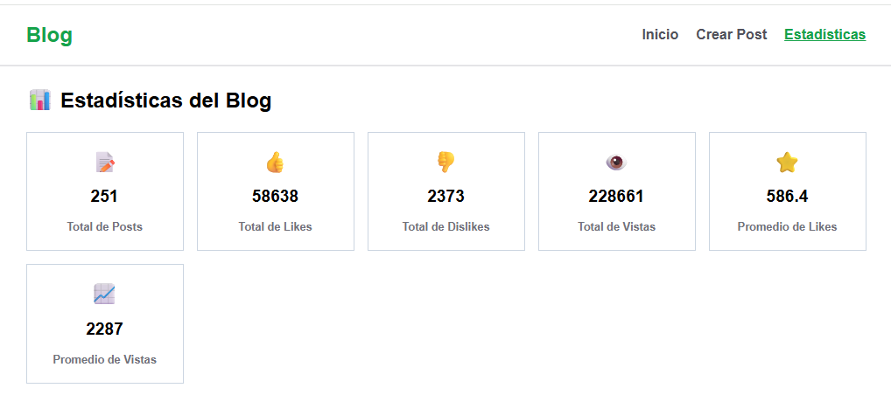

# BlogCRUD - Proyecto CRUD
 
Aplicación web de tipo blog que implementa CRUD completo sobre una API REST, usando únicamente HTML, CSS y JavaScript vanilla.
 
## Descripción
 
BlogCRUD es una aplicación web que permite gestionar publicaciones de blog con las siguientes funcionalidades:
 
- **Crear** nuevas publicaciones con título, contenido, autor y tags
- **Leer** listado de publicaciones con paginación y vista de detalle
- **Actualizar** publicaciones existentes
- **Eliminar** publicaciones con confirmación
 
La aplicación cuenta con búsqueda por texto, filtros por tags y usuario, y una sección de estadísticas del blog.
 
## API Utilizada
 
**DummyJSON** - [https://dummyjson.com](https://dummyjson.com)
 
Endpoints utilizados:
 
| Verbo | Endpoint | Descripción |
|-------|----------|-------------|
| GET | `/posts?limit=10&skip=0` | Listar posts con paginación |
| GET | `/posts/{id}` | Obtener detalle de un post |
| GET | `/users/{id}` | Obtener información del autor |
| GET | `/posts/search?q={texto}` | Buscar posts por texto |
| GET | `/posts/tag/{tag}` | Filtrar posts por tag |
| GET | `/posts/tags` | Obtener lista de tags disponibles |
| POST | `/posts/add` | Crear nuevo post |
| PUT | `/posts/{id}` | Actualizar post existente |
| DELETE | `/posts/{id}` | Eliminar post |
 
> **Nota:** DummyJSON es una API de prueba que simula las operaciones pero no persiste los cambios en una base de datos real. Las operaciones POST, PUT y DELETE funcionan correctamente y devuelven respuestas válidas.
 
## Instrucciones de Uso
 
### Requisitos previos
- Navegador web moderno (Chrome, Firefox, Edge)
- Editor de código (VS Code recomendado)
- Extensión Live Server para VS Code
 
### Instalación local
 
1. Clonar el repositorio:
```bash
git clone https://github.com/dquan123/Web_Proyecto1.git
```
 
2. Abrir la carpeta del proyecto en VS Code
 
3. Click derecho en `index.html` → "Open with Live Server"
 
4. La aplicación se abrirá en `http://127.0.0.1:5500`
 
> **Importante:** Los módulos ES6 requieren un servidor HTTP. No abrir el archivo directamente con doble clic.
 
### Uso de la aplicación
 
1. **Inicio:** Ver listado de publicaciones con paginación (10 por página)
2. **Ver detalle:** Click en "Ver detalle" para ver información completa del post
3. **Crear post:** Click en "Crear Post" en el menú de navegación
4. **Editar post:** Desde la vista de detalle, click en "Editar"
5. **Eliminar post:** Desde la vista de detalle, click en "Eliminar" (requiere confirmación)
6. **Filtros:** Usar la barra de filtros para buscar por texto, tag o usuario
7. **Estadísticas:** Click en "Estadísticas" para ver métricas del blog
 
## Estructura del Proyecto
 
```
proyecto-blog/
├── index.html          ← Página principal
├── README.md           ← Este archivo
├── .gitignore          ← Archivos ignorados por Git
├── css/
│   ├── main.css        ← Estilos globales y variables CSS
│   ├── layout.css      ← Navegación y estructura de páginas
│   └── components.css  ← Cards, botones, formularios, modales
└── js/
    ├── api.js          ← Funciones de conexión con la API (fetch)
    ├── ui.js           ← Funciones de renderizado del DOM
    ├── validation.js   ← Validaciones de formularios
    ├── router.js       ← Lógica de navegación entre vistas
    └── main.js         ← Punto de entrada, estado, inicialización
```
 
## Funcionalidades
 
### CRUD Completo
- **GET:** Listado paginado y vista de detalle
- **POST:** Formulario de creación con validaciones
- **PUT:** Formulario de edición precargado
- **DELETE:** Eliminación con confirmación
 
### Filtros (3 combinables)
- Búsqueda por texto (título y contenido)
- Filtro por tags
- Filtro por ID de usuario
 
### Feedback al Usuario
- Estado de carga mientras se espera la API
- Mensajes de error descriptivos
- Toast de éxito al completar acciones
- Mensaje cuando no hay resultados
 
### Validaciones
- Título: mínimo 5 caracteres
- Contenido: mínimo 20 caracteres
- Autor: obligatorio (mínimo 2 caracteres)
- Errores inline junto a cada campo
 
## Sección Adicional: Estadísticas
 
Elegimos implementar una sección de **Estadísticas** porque aporta valor al mostrar métricas agregadas del blog que no son visibles en las vistas individuales.
 
### Métricas incluidas:
- **Total de posts** en el blog
- **Total de likes y dislikes** acumulados
- **Total de vistas** de todas las publicaciones
- **Promedio de likes** por post
- **Promedio de vistas** por post
- **Top 5 tags** más utilizados
- **Top 5 posts** más populares (por likes)
 
Esta sección permite a los usuarios tener una visión general del engagement y las tendencias del contenido del blog.
 
## Tecnologías Utilizadas
 
- **HTML5** semántico
- **CSS3** (variables, flexbox, grid, media queries)
- **JavaScript ES2022+** (async/await, módulos ES6, fetch API)
- **Git y GitHub** para control de versiones
 
## Responsive Design
 
La aplicación es responsive y se adapta a:
- Móviles (320px - 767px)
- Tablets (768px - 1024px)
- Escritorio (1024px+)
 
## Integrantes del Equipo
 
| Nombre | Rol |
|--------|-----|
| Diego | Repositorio, API, Router, Estados, README, Deploy |
| Quique | UI, Formularios, Validaciones, CSS, Filtros, Estadísticas |
 
## Screenshots
 
### Vista de Listado

 
### Vista de Detalle

 
### Formulario de Crear

 
### Estadísticas

  
## Demo en Producción
 
[Ver aplicación desplegada](#)
 
---
 
**Proyecto CRUD** - Sistemas y Tecnologías Web - UVG 2025
